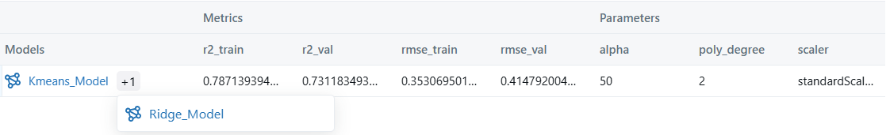
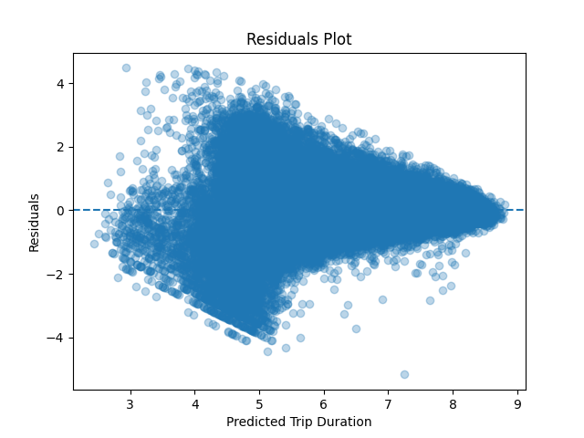

# Trip Duration Predictor

## Project Overview
The **Trip Duration Predictor** aims to estimate the duration of taxi rides by analyzing spatial, temporal, and categorical features. The project follows an end-to-end machine learning workflow starting from data preprocessing and feature engineering, through model training and experiment tracking, and ending with deployment as a RESTful API.

Key components of the project include:
- Feature engineering based on geographic and temporal data
- Machine learning pipeline using **Ridge Regression**
- Experiment tracking with **MLflow**
- Model serving using **FastAPI**
- Containerization using **Docker**
- Command-line configuration via **argparse**

---

## Tech Stack
- Python
- Pandas
- NumPy
- scikit-learn
- MLflow
- FastAPI
- Docker
- Matplotlib

---

## Project Structure
```text
.
├── assets/                         # Documentation assets 
│   ├── mlflow_ui.png
│   ├── residuals_train.png
│   └── train_actual_vs_pred.png
│
├── models/                         # Saved trained models
│   ├── Kmeans_model.pkl
│   └── Ridge_model.pkl
│
├── notebooks/                      # Exploratory Data Analysis
│   └── Trip Duration EDA.ipynb
│
├── script/
│   ├── main.py                     # Training entry point (argparse)
│   └── test_pipeline_data_feature.py
│
├── src/
│   ├── app/
│   │   └── api.py                  # FastAPI application
│   │
│   ├── data/
│   │   ├── load_data.py            # Data loading 
│   │   └── preprocess.py           # Data cleaning & preprocessing
│   │
│   ├── features/
│   │   ├── feature_engineering.py  # Feature engineering 
│   │   └── preprocessing.py        # Feature preprocessing
│   │
│   ├── models/
│   │   ├── train.py                # Model training
│   │   └── evaluate.py             # Model evaluation
│   │
│   ├── serving/
│   │   └── inference.py            # Model inference 
│   │
│   ├── utils/
│   │   ├── feature_utils.py
│   │   └── model_utils.py
│   │
│   └── visualization/
│       └── plots.py                # Visualization utilities
│
├── .dockerignore
├── .gitignore
├── Dockerfile
├── requirements.txt
└── README.md

````

---

## Contents

* [Data Cleaning](#data-cleaning)
* [Feature Engineering](#feature-engineering)
* [Cluster Feature Extraction](#cluster-feature-extraction)
* [Data Visualization](#data-visualization)
* [Data Transformation](#data-transformation)
* [Machine Learning Model](#machine-learning-model)
* [Experiment Tracking with MLflow](#experiment-tracking-with-mlflow)
* [Installation & Setup](#installation--setup)
* [Deployment](#deployment)
* [API Usage](#api-usage)
* [Model Evaluation and Visualization](#model-evaluation-and-visualization)
* [Results](#results)

---

## Data Cleaning

The initial step focused on improving data quality by addressing outliers and inconsistencies. This included:

* Removing trips with invalid or extreme durations
* Filtering invalid latitude and longitude values
* Handling missing values in critical columns
* Applying log transformation to the target variable to reduce skewness

---

## Feature Engineering

In addition to raw geographic coordinates, several engineered features were introduced:

* **Haversine distance** between pickup and dropoff points
* **Manhattan distance** as an approximation of city-block travel
* Directional features based on coordinate differences
* Time-based features extracted from pickup datetime (hour, day, weekday)

These features significantly improved the model’s predictive capability.

---

## Cluster Feature Extraction

The **MiniBatchKMeans** algorithm was applied to pickup and dropoff coordinates to capture spatial patterns.
This resulted in the creation of:

* `pickup_cluster`
* `dropoff_cluster`

These features help the model learn region-based traffic behavior.

---

## Data Visualization

Exploratory data analysis was performed using visualizations:

* Categorical feature distributions
* Trip duration distributions

A strong right-skew was observed in trip duration, motivating the use of a logarithmic transformation.

---

## Data Transformation

Data preprocessing was implemented using **ColumnTransformer**:

* **StandardScaler** for numerical features
* **OneHotEncoder** for categorical features

Datetime features were parsed to extract meaningful temporal components such as hour and day.

---

## Machine Learning Model

A unified **scikit-learn Pipeline** was constructed consisting of:

* **ColumnTransformer** for preprocessing
* **PolynomialFeatures** (degree = 2) to capture feature interactions
* **Ridge Regression** with `alpha = 50` to handle multicollinearity

This pipeline design ensures consistency between training and inference.

---

## Experiment Tracking with MLflow

The project uses **MLflow** to track experiments, including:

* Logged hyperparameters (`alpha`, `scaler`, `poly_degree`)
* Performance metrics (RMSE, R²) for training and validation sets
* Stored artifacts such as trained models and evaluation plots



---

## Installation & Setup

### Local Setup

```bash
pip install -r requirements.txt
python -m scripts.main
```

### Docker Setup

```bash
docker build -t trip-duration-api .
docker run -p 8000:8000 trip-duration-api
```

---

## Deployment

The trained model is deployed using **FastAPI**.
Docker is used to ensure environment consistency and easy deployment across different systems.

---

## API Usage

### Endpoint

```http
POST /predict
```

### Request Example

```json
{
  "id": "id2465947",
  "vendor_id": 1,
  "pickup_datetime": "2016-06-25 19:28:52",
  "passenger_count": 1,
  "pickup_longitude": -73.9763412475586,
  "pickup_latitude": 40.763633728027344,
  "dropoff_longitude": -73.97334289550781,
  "dropoff_latitude": 40.7434196472168,
  "store_and_fwd_flag": "N"
}

```

### Response Example

```json
{
  "trip_duration": 7.759280004574624
}
```
> **Note**: The predicted `trip_duration` is returned in log scale.  
> To obtain the duration in seconds: `np.expm1(prediction)`
> 
---

## Model Evaluation and Visualization

### Actual vs Predicted Plot

The plot below shows the relationship between true and predicted trip durations.


### Residuals Plot

The residuals plot highlights prediction errors across different trip durations.



---

## Results

| Metric | Training R² | Training RMSE | Validation R² | Validation RMSE | Test R² |
| ------ | ----------- | ------------- | ------------- | --------------- | ------- |
| Values | 0.7871      | 0.3531        | 0.7312        | 0.4148          | 0.7353  |

